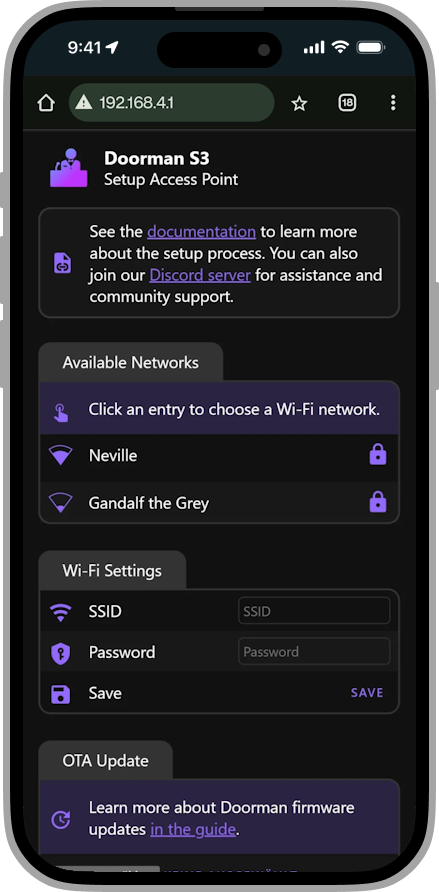
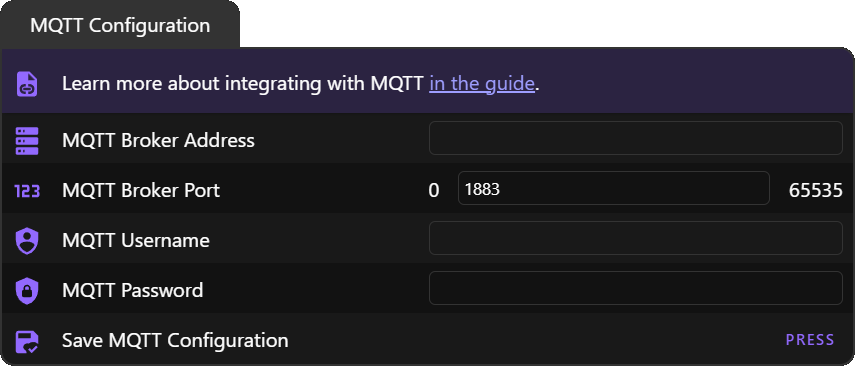

# Erste Schritte

Ist das dein erster Besuch hier? Keine Sorge, wir haben alles für dich vorbereitet! 😊

Unten findest du eine Schritt-für-Schritt-Anleitung, die dich beim ersten Einrichten deines **Doorman** begleitet. Folge einfach den Schritten — alles ist genau in der Reihenfolge, wie du es brauchst.

**Vielen Dank, dass du Doorman verwendest und dieses Projekt unterstützt! ❤️**

## Haftungsausschluss

Durch die Nutzung oder Installation von Doorman übernimmst du die volle Verantwortung für alle Änderungen an deiner Gegensprechanlage.
Das Verhalten des Systems kann je nach individueller Installation und Umgebung variieren.

Wenn du dir bei der Einrichtung oder Verkabelung unsicher bist, konsultiere bitte eine **qualifizierte Elektrofachkraft**.
Eine unsachgemäße Installation kann zu **Fehlfunktionen oder Schäden an deiner Türsprechanlage** führen.

:::tip HINWEIS
Dies ist **kein offizielles oder zertifiziertes Produkt**. Es basiert auf Reverse Engineering und wird **ohne Garantie auf Kompatibilität, Sicherheit oder Funktionalität** bereitgestellt.
:::

## Firmware flashen
Wenn du ein **vorgeflashtes Doorman-Board** gekauft hast, kannst du diesen Schritt einfach überspringen — du bist startklar! 🎉

Falls du aber dein **eigenes Board gebaut** hast oder die **Firmware aktualisieren** möchtest, ist jetzt der richtige Zeitpunkt zum Flashen.
Sonst sitzt du da und wunderst dich, warum nichts passiert. 😄

<a class="btn" target="_blank" href="./firmware/installation">Firmware installieren oder updaten</a>

## Kabel anschließen
Öffne als Erstes das Gehäuse deiner Innenstation. Bei den meisten Modellen findest du Schraubklemmen mit der Beschriftung `a`, `b`, `E` und `P`.

Der Doorman wird — wie jedes andere Gerät — **parallel zum Bus** angeschlossen.

::: danger VORSICHT
**Schließe NIEMALS eine externe Stromquelle an die TC:BUS-Terminale an!**

Dies kann zu **erheblichen Schäden** führen.  
Bitte überprüfe alle Verbindungen stets sorgfältig und mehrmals, bevor du etwas anschließt.
:::

### Stromversorgungsoptionen:
::: details 3-Draht-Modus über die Innenstation <Badge type="tip" text="Empfohlen" />
> [!DANGER] WICHTIG
> **Bitte entferne die Jumper-Kappe auf `BUS PWR`, bevor du fortfährst!**
>
> Die Stromversorgung der Türsprechanlage muss **mindestens 60 mA** liefern können – das ist in der Regel der Fall.
> Da die verfügbare Leistung jedoch begrenzt ist, kann das **direkte Anschließen zusätzlicher Geräte wie des Doorman-S3 an den Bus zu Instabilitäten im System führen**.

Schließe die `b`-Leitung (Ground) an einen der TC:BUS-Anschlüsse deines Doorman und die `a`-Leitung (24V Bus) an den anderen TC:BUS-Anschluss an.

Verbinde anschließend die `P`-Leitung (+24V) mit dem `P`-Terminal an deinem Doorman.

Beispiel:
{width=300px}
:::

::: details 2-Draht-Modus über die Innenstation <Badge type="danger" text="Hardware Revision 1.5 und neuer" />
> [!INFO] INFO
> Die Nutzung der `a`-Bus-Leitung als Stromquelle bei älteren Hardware Revisionen als `1.5` führt zu einem lauten Piepton. Dieses Problem tritt wahrscheinlich aufgrund der Hochfrequenz-Schaltstromversorgung auf.
>
> Ab Hardware Revision `1.5` erzeugt diese Methode nur noch ein leises, aber dennoch wahrnehmbares Rauschen im Lautsprecher.

> [!DANGER] WICHTIG
> Die Stromversorgung der Türsprechanlage muss **mindestens 60 mA** liefern können – das ist in der Regel der Fall.
> Da die verfügbare Leistung jedoch begrenzt ist, kann das **direkte Anschließen zusätzlicher Geräte wie des Doorman-S3 an den Bus zu Instabilitäten im System führen**.

Schließe die `b`-Leitung (Ground) an einen der TC:BUS-Anschlüsse deines Doorman und die `a`-Leitung (24V Bus) an den anderen TC:BUS-Anschluss an.

Setze anschließend die Jumper-Kappe auf `BUS PWR`, um die Stromversorgung zu aktivieren.

Beispiel:
{width=300px}
:::

::: details 2-Draht-Modus über externe Stromversorgung
> [!DANGER] WICHTIG
> Bitte entferne die Jumper-Kappe auf `BUS PWR`, bevor du fortfährst!

Schließe die `b`-Leitung (Ground) an einen der TC:BUS-Anschlüsse deines Doorman und die `a`-Leitung (24V Bus) an den anderen TC:BUS-Anschluss an.

Verbinde die externe Stromversorgung mit deinem Doorman über die Schraubklemmen `P` (+5V bis +30V) und `G` (Ground).

Beispiel:
{width=300px}
:::

::: details 2-Draht-Modus über externe USB-C-Stromversorgung
> [!DANGER] WICHTIG
> Bitte entferne die Jumper-Kappe auf `BUS PWR`, bevor du fortfährst!

Schließe die `b`-Leitung (Ground) an einen der TC:BUS-Anschlüsse deines Doorman und die `a`-Leitung (24V Bus) an den anderen TC:BUS-Anschluss an.

Verbinde anschließend die externe Stromversorgung über den USB-C-Anschluss.

Beispiel:
{width=300px}
:::

## Mit WLAN verbinden
Wenn du deinen **Doorman-S3** zum ersten Mal einschaltest, beginnt er **schnell orange zu blinken** — das bedeutet, er ist bereit für die WLAN-Einrichtung!

Du kannst ihn auf eine von drei Arten mit dem WLAN verbinden:  
**Access Point**, **Improv Serial (USB)** oder **Improv Bluetooth**.

### Access Point

   

   1. **Verbinde dich mit dem WLAN-Netzwerk** namens `Doorman-S3 Setup`.
      Verwende das Passwort: `Op3n-Sesame!`

   2. Sobald die Verbindung steht, sollte sich die **Einrichtungsseite automatisch öffnen**.
      ::: tip
      Eventuell erscheint auch ein Pop-up oder eine Benachrichtigung, um dich beim Netzwerk anzumelden.
      :::

      Falls nichts passiert, öffne einfach deinen Browser und gehe zu **http://192.168.4.1** oder klicke auf den Button unten:

      

         <a class="btn" target="_blank" href="http://192.168.4.1">Verbinde Doorman mit dem WLAN</a>
      

   3. Gib die **WLAN-Zugangsdaten** für das Netzwerk ein, mit dem dein Doorman verbunden werden soll.

   4. Sobald die Meldung **„Wi-Fi connected successfully“** erscheint, kannst du das Fenster schließen.

   5. Dein **Doorman** ist jetzt verbunden und kann in **Home Assistant** über die **ESPHome-Integration** hinzugefügt werden.

   

   

      
   

### Improv Bluetooth <Badge type="tip" text="Home Assistant" />

   

   1. Stelle sicher, dass dein **Home Assistant** auf dem neuesten Stand ist — so ist die volle Kompatibilität mit deinem **Doorman** gewährleistet.

   2. Öffne die **Home Assistant**-App auf deinem Mobilgerät.

   3. Gehe zu **Einstellungen → Geräte & Dienste**.

   4. Suche nach einem neuen Gerät namens **`doorman-s3` (Improv via BLE)** und tippe auf **Hinzufügen**.

   5. Gib die **WLAN-Zugangsdaten** für das Netzwerk ein, mit dem dein Doorman verbunden werden soll.

   6. Sobald die Meldung **„Wi-Fi connected successfully“** erscheint, bist du fertig — du kannst das Popup schließen.

   7. Dein **Doorman** ist jetzt bereit, über die **ESPHome-Integration** in Home Assistant hinzugefügt zu werden.

   

   

      
   

### Improv Bluetooth
Du kannst deinen Doorman auch über Bluetooth mit dem WLAN verbinden. Das ist eine schnelle und einfache Möglichkeit — besonders praktisch, wenn du ein Handy oder einen Laptop mit Bluetooth nutzt.

Stelle sicher, dass dein Doorman eingeschaltet und in der Nähe ist, und klicke dann auf den Button unten, um zu starten:

<improv-wifi-launch-button>
   <button slot="activate">
         

            <a class="btn">Verbinde Doorman mit dem WLAN</a>
         

   </button>
   

         

            
OH SNAP!

            
Your browser does not support provisioning :(

         

   

</improv-wifi-launch-button>

### Improv Serial <Badge type="tip" text="USB Verbindung" />
Wenn dein Doorman nicht automatisch angezeigt wird oder du ihn zum ersten Mal einrichtest, ist diese Methode eine super Alternative.

Schließe deinen Doorman einfach per USB-Kabel an deinen Computer an und klicke dann auf den Button unten, um die WLAN-Verbindung einzurichten:

<improv-wifi-serial-launch-button>
   <button slot="activate">
         

            <a class="btn">Verbinde Doorman mit dem WLAN</a>
         

   </button>
   

         

            
OH SNAP!

            
Your browser does not support provisioning :(

         

   

</improv-wifi-serial-launch-button>

## Zu Home Assistant hinzufügen <Badge type="tip" text="Nur Home Assistant Variante" />
:::warning BEVOR DU WEITERMACHST
Dies ist die Standard-Variante für alle vorgeflashten Doorman-Geräte.
Diesen Schritt kannst du überspringen, wenn du nicht die `Home Assistant` Smart Home Variante geflasht hast.
:::

Nachdem deinen Doorman mit dem WLAN verbunden ist, blinkt die LED langsam blau. Das bedeutet, er wartet darauf, dass sich Home Assistant verbindet.

   

   Dein Doorman sollte automatisch in Home Assistant erscheinen. Falls nicht, blockiert dein Netzwerk möglicherweise mDNS (Multicast DNS), das für die automatische Geräteerkennung notwendig ist.

   1. Stelle sicher, dass deine **Home Assistant**-Installation auf dem neuesten Stand ist, um die volle Kompatibilität mit deinem Doorman-Gerät zu gewährleisten.

   2. Öffne die **Home Assistant**-App auf deinem mobilen Gerät und gehe zu **Einstellungen → Geräte & Dienste**.

   3. Suche nach einem neuen Gerät mit der Bezeichnung **`Doorman S3` (ESPHome)** und tippe auf **Hinzufügen**.

   4. Nach erfolgreicher Verbindung leuchtet die LED für 3 Sekunden durchgehend blau. Dein **Doorman** ist jetzt in **Home Assistant** eingebunden und einsatzbereit.

   

   

      
   

## MQTT Broker einrichten <Badge type="tip" text="Nur MQTT Variante" />
:::warning BEVOR DU WEITERMACHST
Diesen Schritt kannst du überspringen, wenn du nicht die `MQTT` Smart Home Variante geflasht hast.
:::

Nachdem du deinen Doorman mit dem WLAN verbunden hast, wird die LED **rot und blau pulsieren**. Das bedeutet, der MQTT-Broker ist noch nicht konfiguriert.

1. Öffne die Weboberfläche deines Doormans und gehe zum Abschnitt **`MQTT-Konfiguration`**.

2. Gib deine MQTT-Broker-Zugangsdaten ein.

   

   Wenn du die Einstellungen nicht findest, scrolle ganz nach unten und klicke auf "Alle anzeigen".

3. Speichere die Einstellungen — die Firmware versucht dann, eine Verbindung zu deinem MQTT-Broker herzustellen.

4. Wenn die Verbindung erfolgreich ist, leuchtet die Status-LED zur Bestätigung **3 Sekunden lang durchgehend blau**.

## Interaktive Einrichtung
::: tip
Wenn du deinen Doorman zum ersten Mal mit Home Assistant verbindest,\
befindet er sich bereits im `Setup Mode` für die interaktive Einrichtung.

Du musst den Modus nicht manuell aktivieren; er wird bei jedem Neustart automatisch gestartet, solange der Einrichtungsprozess nicht abgeschlossen oder abgebrochen wurde.
:::

### 1. Zugriff auf die Einstellungen
Öffne die Einstellungen entweder über die Weboberfläche deines Doormans oder besuche die [ESPHome Integrationsseite](https://my.home-assistant.io/redirect/integration/?domain=esphome) und wähle das Doorman S3-Gerät aus.

### 2. Aktiviere den Setup-Modus
Geh zum Bereich `Konfiguration` und schalte den `Setup-Modus` ein, um mit der interaktiven Einrichtung zu beginnen.  
Sobald der Setup-Prozess beginnt, wird die RGB-Status-LED grün-türkis pulsieren.

::: warning BEVOR DU WEITERMACHST
Deine Innenstation **muss angeschlossen sein**, damit die Einrichtung abgeschlossen werden kann.
:::

### 3. Warte, bis du auf die Klingel drückst
Wenn du den Klingelknopf an deiner Wohnung oder am Eingang drückst, speichert das System die Seriennummer deiner Innenstation und versucht, das Modell zu erkennen.

:::info
Wenn du mehrere Außenstationen hast, versucht die Firmware, zusätzliche Stationen automatisch zu erkennen.

Um die **zweite Klingel** zu erkennen und das **Öffnen der zweiten Tür** zu ermöglichen, musst du **die zweite Klingeltaste drücken** oder **den Tür der zweiten Tür manuell betätigen** – aber erst **nachdem die Einrichtung abgeschlossen ist**.

🕒 Warte etwa **eine Minute nach Abschluss der Einrichtung**, damit die Adresse der zweiten Tür korrekt gespeichert werden kann.
:::

Sobald das Modell erfolgreich erkannt wurde, wird der Speicher deiner Innenstation ausgelesen.  
**Hinweis:** Der gesamte Prozess kann **bis zu 30 Sekunden** dauern.

Wenn das Modell erfolgreich erkannt wurde oder die Zeit abläuft, wird die Einrichtung abgeschlossen.

### 4. Einrichtung abgeschlossen
Die LED leuchtet 3 Sekunden lang grün-türkis und geht dann aus, der Setup-Modus wird deaktiviert. Die Einrichtung ist abgeschlossen.

## Nächste Schritte
Du möchtest deinen Doorman konfigurieren? Öffne dafür die Weboberfläche von Doorman oder das [Geräte-Dashboard](https://my.home-assistant.io/redirect/integration/?domain=esphome) in Home Assistant.

Falls du dir unsicher bist, was jede Entität macht, welche Funktionen sie steuert oder wie du sie einrichtest, findest du in der [Entitätsreferenz](../reference/entities) eine ausführliche Anleitung zu allen verfügbaren Entitäten und deren Konfigurationsmöglichkeiten.

## Hast du noch Probleme?
Falls du Probleme hast, deinen Doorman in Home Assistant einzurichten, helfen wir dir gerne weiter.
Tritt unserem [Discord](https://discord.gg/t2d34dvmBf) bei, um Unterstützung zu bekommen und dich mit anderen Nutzern auszutauschen.