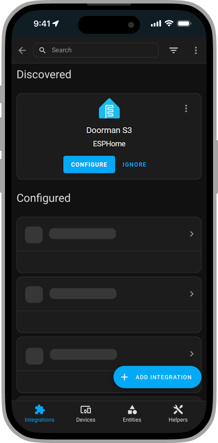

# Getting Started

First time here? Don't worry — we've got you covered! 😊

Below is a step-by-step guide to help you set up your Doorman for the very first time. Just follow along — everything is laid out in the order you need to do it.

Thank you so much for choosing Doorman and supporting this project! ❤️

## Flashing the Firmware
If you bought a **pre-flashed Doorman PCB**, you're good to go — skip this step! 🎉

But if you **built your own board** or need to **update the firmware**, now's the time to flash it.
Otherwise, you'll be staring at a very quiet device while wondering why nothing works. 😄

<a class="btn" target="_blank" href="./firmware/installation">Install or Update Firmware</a>

## Connect the Wires
First, open your indoor station enclosure. On most models, you will find a screw terminal labeled with `a`, `b`, `E`, and `P`.

::: danger
**NEVER CONNECT AN EXTERNAL POWER SOURCE TO THE TC:BUS TERMINALS  
DOING SO CAN CAUSE SEVERE DAMAGE.**
:::

Connect the `b` line (Ground) to one of the TC:BUS terminals on your Doorman, and connect the `a` line (24V Bus) to the other TC:BUS terminal on your Doorman. Doorman is just like any other device on the bus, **connected in parallel**.

::: warning NOTE
By default, I ship version 1.5 with a jumper cap on `BUS PWR`. Please remove this if you are not connecting Doorman in the `2-Wire Mode via indoor station` configuration.
:::

### Power supply options:
::: details 3-Wire Mode via indoor station <Badge type="tip" text="Recommended" />
Connect the `P` line (+24V) to the `P` terminal on your Doorman.

> [!WARNING]
> The intercom power supply must provide at least 60mA.

Example:
{width=300px}
:::

::: details 2-Wire Mode via external wired Power Supply
Connect the external power supply to your Doorman using the `P` (+5V to +30V) and `G` (Ground) screw terminals.

Example:
{width=300px}
:::

::: details 2-Wire Mode via external USB-C Power Supply
Connect the external power supply via the USB-C port.

Example:
{width=300px}
:::

::: details 2-Wire Mode via indoor station <Badge type="danger" text="Hardware revision 1.5 and later" />
> [!DANGER] Important Info
> Using the `a`-bus line as a power source on revisions older than `1.5` results in a loud beeping noise. This issue is likely due to the high-frequency switching power supply.
>
> Starting with revision `1.5` this method will only produce a subtle, yet noticeable hissing sound on the speaker.

After connecting the `a` and `b` lines, you need to connect `BUS PWR` using a jumper cap.

Example:
{width=300px}
:::

## Connect to Wi-Fi
When you power on your **Doorman-S3** for the first time, it will start **blinking rapidly in orange** — that means it's ready for Wi-Fi setup!

You can connect it to Wi-Fi using one of three methods:  
**Access Point**, **Improv Serial (USB)**, or **Improv Bluetooth**.

### Access Point

   

   1. **Connect to the Wi-Fi network** named `Doorman-S3 Setup`.
      Use the password: `Op3n-Sesame!`

   2. Once connected, the **setup page should open automatically**.
      ::: tip
      You might also see a pop-up or notification asking you to sign in to the network.
      :::

      If nothing happens, just open your browser and go to **http://192.168.4.1** or click the button below:

      

         <a class="btn" target="_blank" href="http://192.168.4.1">Connect Doorman to Wi-Fi</a>
      

   3. Enter the **Wi-Fi credentials** for the network you want your Doorman to join.

   4. Once you see **“Wi-Fi connected successfully”**, you can close the window.

   5. Your **Doorman** is now connected and ready to be added to **Home Assistant** using the **ESPHome integration**.

   

   

      
   

### Improv Bluetooth <Badge type="tip" text="Home Assistant" />

   

   1. Make sure your **Home Assistant** is updated to the latest version — this ensures full compatibility with your **Doorman** device.

   2. Open the **Home Assistant** app on your mobile device.

   3. Go to **Settings → Devices & Services**.

   4. Look for a new device named **`doorman-s3` (Improv via BLE)** and tap **Add**.

   5. Enter the **Wi-Fi credentials** for the network you want the device to connect to.

   6. When you see **“Wi-Fi connected successfully”**, you're all set — you can close the prompt.

   7. Your **Doorman** is now ready to be added to Home Assistant using the **ESPHome integration**.

   

   

      
   

### Improv Bluetooth
You can also connect your Doorman to Wi-Fi using Bluetooth. This is a quick and easy option — especially if you're using a phone or laptop with Bluetooth support.

Make sure your Doorman is powered on and nearby, then click the button below to start:

<improv-wifi-launch-button>
   <button slot="activate">
         

            <a class="btn">Connect Doorman to Wi-Fi</a>
         

   </button>
   

         

            
OH SNAP!

            
Your browser does not support provisioning :(

         

   

</improv-wifi-launch-button>

### Improv Serial <Badge type="tip" text="USB Connection" />
If your device isn't showing up automatically, or you're setting it up for the first time, this method is a great alternative.

Just connect your Doorman to this computer using a USB cable, then click the button below to connect it to Wi-Fi:

<improv-wifi-serial-launch-button>
   <button slot="activate">
         

            <a class="btn">Connect Doorman to Wi-Fi</a>
         

   </button>
   

         

            
OH SNAP!

            
Your browser does not support provisioning :(

         

   

</improv-wifi-serial-launch-button>

## Add to Home Assistant <Badge type="tip" text="Home Assistant variant only" />

:::warning BEFORE YOU PROCEED
This is the **default** for all **pre-flashed Doorman** units.  
You can skip this step if you haven't flashed the `Home Assistant` Smart Home variant.
:::

After you connect your Doorman to your Wi-Fi network, it will start blinking slowly in blue. This means it's waiting for Home Assistant to connect.

   

   It should appear automatically in Home Assistant. If it doesn't, your network may be blocking mDNS (Multicast DNS), which is required for device discovery.

   1. Make sure your **Home Assistant** instance is **updated** to the latest version to ensure compatibility with your Doorman device.

   2. Open the **Home Assistant** app on your mobile device and navigate to **Settings → Devices & Services**.

   3. Look for a new device labeled **`Doorman S3` (ESPHome)** and tap **Add**.

   4. After a successful connection, it will light up solid blue for 3 seconds. Your **Doorman** is now added to **Home Assistant** and ready to use.

   

   

      
   

## Setup MQTT Broker <Badge type="tip" text="MQTT variant only" />

:::warning BEFORE YOU PROCEED
You can skip this step if you haven't flashed the `MQTT` Smart Home variant.
:::

After you connect your Doorman to your Wi-Fi network, it will **pulse red and blue**. This means the MQTT broker is not yet configured.

1. Open the web interface and go to the `MQTT Configuration` section.

2. Enter your MQTT broker credentials.

   

   If you don't see these settings, scroll to the bottom and click "Show all".

3. Save the settings — the firmware will then try to connect to your MQTT broker.

4. If it connects successfully, the status LED will light up **solid blue for 3 seconds** to confirm.

## Interactive Setup
::: tip
When you first connect your Doorman to Home Assistant, it will be in `Setup Mode` for interactive setup already.

You don't need to manually activate this mode; it will start automatically at each reboot as long as the setup process has not been completed or canceled.
:::

### 1. Access the Settings
Open the settings either through your Doorman's Webinterface or visit the [ESPHome Integration page](https://my.home-assistant.io/redirect/integration/?domain=esphome) and select the Doorman S3 device.

### 2. Activate Setup Mode
Go to the `Configuration` section and enable `Setup Mode` to begin the interactive setup.  
Once the setup process begins, the RGB status LED will pulse green-turquoise.

::: warning BEFORE YOU PROCEED
The indoor station must be connected, and the enclosure securely closed, to complete the setup process.
:::

### 3. Wait until you ring the doorbell
When you press the doorbell button at your apartment or entrance, the system will save your indoor station's serial number and attempt to detect the model.

:::info
If you have multiple door stations, the firmware will attempt to automatically detect the additional station.

To enable detection of the second doorbell and the ability to unlock the second door, you need to press the second doorbell or physically push the unlock button for the second door at least once **after the setup is finished** to store its address.
:::

Once the model is successfully detected, the system will read the memory of your indoor station.
**Note:** This entire process can take **up to 30 seconds**.

If the model detection is successful or if it times out, the setup will be considered finished.

### 4. Setup complete
The LED will remain green-turquoise for 3 seconds, then turn off, and the setup mode will be turned off. The setup is complete.

## Still having issues?
If you're having trouble setting up your Doorman in Home Assistant, we're here to help.  
Join us on [Discord](https://discord.gg/t2d34dvmBf) to get assistance and discuss with other users.